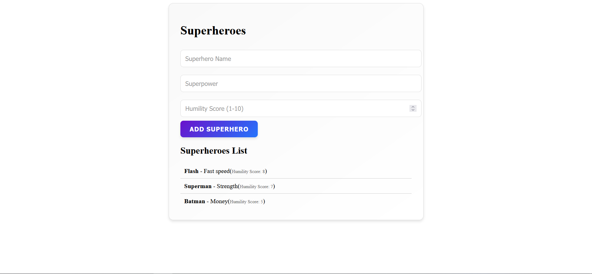

# HUMBLE-SUPERHERO-API

The Humble Superhero API is an application that allows users to add and retrieve superheroes based on their humility score. The project consists of a NestJS backend and an optional React frontend.

[](https://skillicons.dev)

## Table of Contents

- [Demo](#demo)
- [Features](#features)
- [Technologies Used](#technologies-used)
- [Installation](#installation)
- [Usage](#usage)
- [Jest Testing](#jest-tests)
- [Collaboration](#colaboration-notes)
- [If i had more time](#if-i-had-more-time)

## Demo



## Main Features

### 1. Post /superheroes
- Add a superhero with a name, superpower, and humility score (1-10).

### 2. Get /superheroes
- Retrieve superheroes sorted by humility score in descending order.

### 3. Validation
- Ensures humility scores are within the valid range.

### 4. Testing
- Includes Jest tests for key functionality.

### 5. Frontend
- A React UI to interact with the API in real-time.

## Technologies Used

- **Back-End**:
  - [NestJs]
  - [TypeScript]
  - [Jest]

- **Front-End**:
  - [React]
  - [StyledComponents]

- **Tools and Libraries**:
  - [Node.js]
  - [Vite]
  - [Npm]

## Installation & Setup

1. **Clone the repository:**

    ```bash
    git clone https://github.com/AdelinCraciunesc/superhero
    ```

2. **Setup Backend:**

    ```bash
    cd superhero-api
    ```

3. **Install the required dependencies:**

    ```bash
    npm install
    ```

4. **Run Server:**

    ```bash
    npm run start:dev
    ```

5. **Frontend Setup:**

    ```bash
    cd humble-superhero-frontend
    ```

6. **Install the required dependecies:**

    ```bash
    npm install
    ```
7. **Start the frontend**

    ```bash
    npm run dev
    ```

    The app will be available at `http://localhost:5173/`.
    The api wiil be available at `http://localhost:3000/`

## API Usage
1. **Add a Superhero**
    Curl
    ```bash
    curl -X POST http://localhost:3000/superheroes \
    -H "Content-Type: application/json" \
    -d '{"name": "Spider-Man", "superpower": "Wall-crawling", "humilityScore": 9}'
    ```
    Invoke-WebRequest(powershell)
    ```bash
    Invoke-WebRequest -Uri "http://localhost:3000/superheroes" -Method Post -Headers @{ "Content-Type" = "application/json" } -Body '{"name": "Spider-Man", "superpower": "Spider like powers", "humilityScore": 9}'
    ```

    **Response Example**
    ```bash
    StatusCode        : 201
    StatusDescription : Created
    Content           : {"name":"Spider-Man","superpower":"Spider like powers","humilityScore":9}
    RawContent        : HTTP/1.1 201 Created
                        Access-Control-Allow-Origin: http://localhost:5173
                        Vary: Origin
                        Connection: keep-alive
                        Keep-Alive: timeout=5
                        Content-Length: 73
                        Content-Type: application/json; charset=utf-8...
    Forms             : {}
    Headers           : {[Access-Control-Allow-Origin, http://localhost:5173], [Vary, Origin], [Connection, keep-alive],
                        [Keep-Alive, timeout=5]...}
    Images            : {}
    InputFields       : {}
    Links             : {}
    ParsedHtml        : mshtml.HTMLDocumentClass
    RawContentLength  : 73
    ```

2. **Get Superheroes**
    Curl
    ```bash
    curl -X GET http://localhost:3000/superheroes
    ```
    Invoke-WebRequest(powershell)
    ```bash
    Invoke-WebRequest -Uri "http://localhost:3000/superheroes" -Method Get
    ```

    **Response Example**
    ```bash
    StatusCode        : 200
    StatusDescription : OK
    Content           : [{"name":"Spider-Man","superpower":"Spider like
                        powers","humilityScore":9},{"name":"Flash","superpower":"Fast
                        speed","humilityScore":8},{"name":"Superman","superpower":"Strength","humilityScore":7},{"...
    RawContent        : HTTP/1.1 200 OK
                        Access-Control-Allow-Origin: http://localhost:5173
                        Vary: Origin
                        Connection: keep-alive
                        Keep-Alive: timeout=5
                        Content-Length: 255
                        Content-Type: application/json; charset=utf-8
                        Da...
    Forms             : {}
    Headers           : {[Access-Control-Allow-Origin, http://localhost:5173], [Vary, Origin], [Connection, keep-alive],
                        [Keep-Alive, timeout=5]...}
    Images            : {}
    InputFields       : {}
    Links             : {}
    ParsedHtml        : mshtml.HTMLDocumentClass
    RawContentLength  : 255
    ```

## Jest Tests

This project includes **Jest** tests to ensure the functionality of the superhero API endpoints.

### 1. **Run Jest Tests**

To run the tests for the backend:

```bash
npm run test
```

**Example**
```js
it('should create a new superhero', async () => {
    // Example superhero data to be passed into the POST request
    const superhero = { 
    name: 'Thor', 
    superpower: 'God', 
    humilityScore: 7 
    };

    // Mock the service method to return the superhero object
    service.createSuperHero = jest.fn().mockReturnValue(superhero);

    // Call the controller method and check if the result is correct
    const result = await controller.createSuperhero(superhero);

    // Expect the result to match the superhero object
    expect(result).toEqual(superhero);

    // Ensure that the service method was called with the expected argument
    expect(service.createSuperHero).toHaveBeenCalledWith(superhero);
});
```


## Colaboration Notes
If I worked in a team for this project I would propose:
1. Discuss API structure beforehand
2. Split tasks for a better development
3. Write Clear Messages and documentation
4. Using Git branches to avoid conflicts
5. Collaborating and helping each other

## If I had more time
1. Implement a database instead of an in-memory-array
2. Expand on the existing DTO for superheroes with more data such as achievements and photos
3. Add routes for editing and deleting a superhero
4. Improve the frontend UI with better styling and error handlign
5. Add user authentication and authorization
6. Expand test coverage so everything can work smoothly
